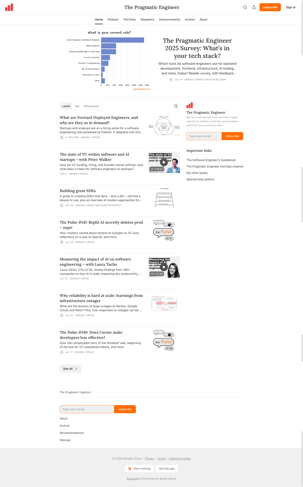

# Substack Premium Scraper

Substack Premium Scraper is a Python tool for downloading free and premium Substack posts and saving them as both Markdown and
HTML files, with an enhanced HTML interface to browse and sort through the posts. It will save paid content as
long as you're subscribed to that Substack.




Once you run the script, it will create a folder named after the substack in `posts/` directory,
and then begin to scrape the substack URL, converting the blog posts into markdown files with enhanced formatting.
Once all the posts have been saved, it will generate styled HTML files with improved CSS support that allow you to browse the posts with better visual presentation.

You can either hardcode the substack URL and the number of posts you'd like to save into the top of the file, or
specify them as command line arguments.

## Features

- Converts Substack posts into Markdown files with proper formatting
- Generates styled HTML files with CSS support for better readability
- Supports free and premium content (with subscription)
- Cookie-based authentication for secure premium content access
- Enhanced progress tracking with visual indicators and emojis
- Comprehensive error handling and validation
- The HTML interface allows sorting essays by date or likes
- Improved metadata extraction and JSON data handling
- Better content filtering and URL handling

## Requirements

- Python 3.7+
- [uv](https://github.com/astral-sh/uv) - An extremely fast Python package installer and resolver
- Camoufox browser automation tool (automatically installed via uv)
- No browser drivers needed (Camoufox handles everything)

## Installation

Clone the repo and install the dependencies:

```bash
git clone https://github.com/yowmamasita/substack-premium-scraper.git
cd substack-premium-scraper

# Install uv if you haven't already
# curl -LsSf https://astral.sh/uv/install.sh | sh  # macOS/Linux
# or visit https://github.com/astral-sh/uv for other installation methods

# Install dependencies using uv
uv pip install -r requirements.txt
```

### Authentication Setup

This tool uses cookie-based authentication instead of form login for better security and reliability.

#### Getting Your Cookies:

1. **Log into Substack:** Open your browser and log into your Substack account
2. **Install extension:** Install [Get cookies.txt LOCALLY](https://chromewebstore.google.com/detail/get-cookiestxt-locally/cclelndahbckbenkjhflpdbgdldlbecc) Chrome extension
3. **Export cookies:** Click the extension icon while on any Substack page and download the cookies
4. **Save cookies:** Move the downloaded `cookies.txt` file to the project root directory
5. **Verify:** The scraper will validate your cookies and notify you if authentication is successful

**Note:** The tool now uses Camoufox (a privacy-focused browser automation tool) instead of Selenium, providing better anti-detection and more reliable scraping.

## Usage

Specify the Substack URL and the directory to save the posts to:

You can hardcode your desired Substack URL and the number of posts you'd like to save into the top of the file and run:
```bash
uv run substack_scraper.py
```

For free Substack sites:

```bash
uv run substack_scraper.py --url https://example.substack.com --directory /path/to/save/posts
```

For premium Substack sites (with cookie authentication):

```bash
uv run substack_scraper.py --url https://example.substack.com --directory /path/to/save/posts --premium --cookies cookies.txt
```

Example with a real premium newsletter:

```bash
uv run substack_scraper.py --url https://newsletter.pragmaticengineer.com --premium --headless
```

To scrape a specific number of posts:

```bash
uv run substack_scraper.py --url https://example.substack.com --directory /path/to/save/posts --number 5
```

## Troubleshooting

### Cookie Authentication Issues
- **Invalid cookies:** Make sure you're logged into Substack when exporting cookies
- **Expired cookies:** Re-export cookies if you've been logged out or if it's been a while
- **Wrong format:** The "Get cookies.txt LOCALLY" extension exports in the correct format automatically

### Scraping Issues
- **Rate limiting:** The tool includes built-in delays to avoid rate limiting
- **Missing content:** Ensure you're subscribed to premium publications you're trying to scrape
- **Browser issues:** Camoufox handles most anti-bot detection automatically

## Contributing

Feel free to submit issues and enhancement requests!

## Acknowledgments

- Original Substack2Markdown by [@timf34](https://github.com/timf34/Substack2Markdown)
